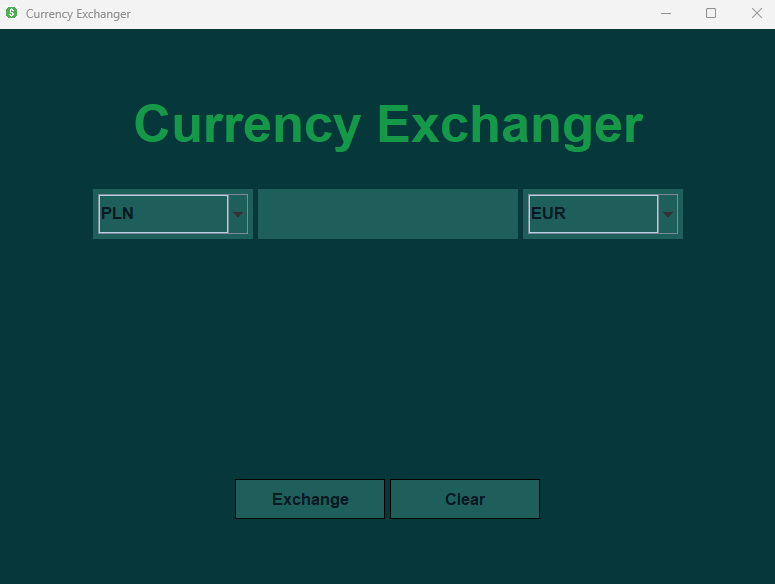
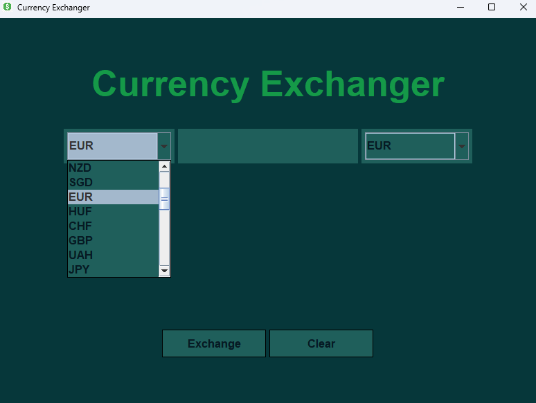
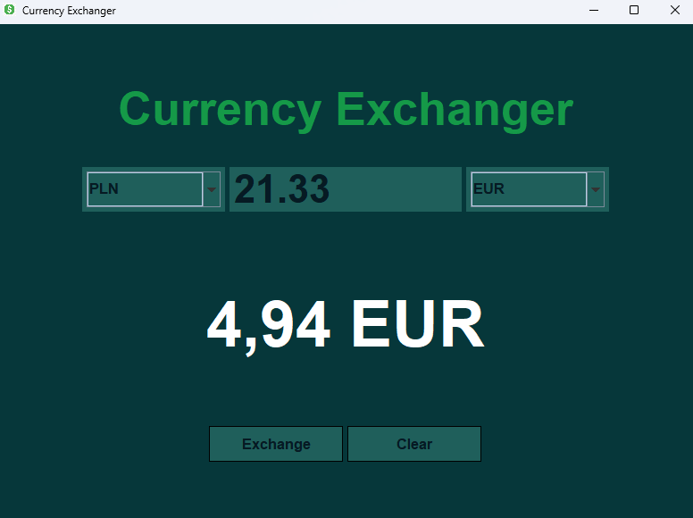
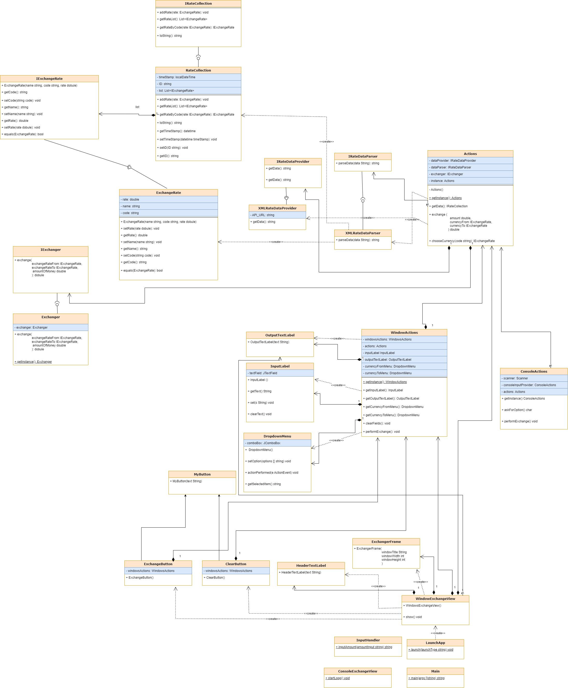

# **Currency Exchanger App**

# **Required:**
    jackson library (included in files)

# **Description:**

    This is a simple app that let user to exchange money using provided currencies fetched form NBP API: https://api.nbp.pl/
    App follows SOLID OPP rules and use singletons.

App design

Choosing currency

After exchange

UML diagram:

# **Functionality:** 

The app provides two modes:

# **1. Flashcards** 
Console view
GUI view

You can change it by switch launch method calling in main file:

    LaunchApp.launch("window");    // open GUI
or
    
    LaunchApp.launch("console");   // open console app

